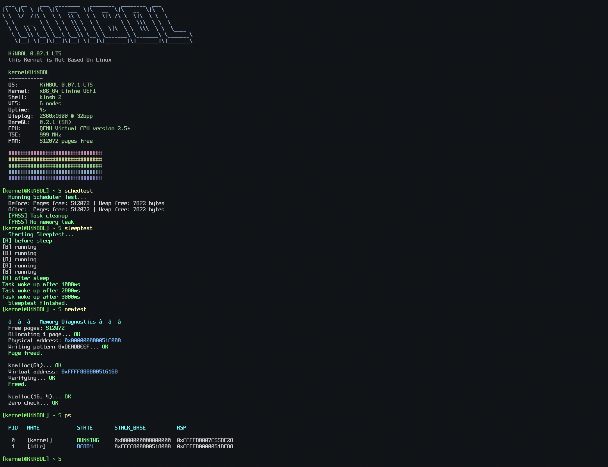

# KiNBOL

> **this Kernel is Not Based On Linux**

x86_64 · UEFI · Limine · Ring 0 only

---



*be advised: this screenshot may not correspond to the newest commit. things move fast around here.*

---

## what is this

KiNBOL is a hobby OS I'm building from scratch to learn how operating systems actually work. It started as a simple framebuffer kernel and grew into something with memory management, interrupts, a scheduler, and a shell.

Most things here are written from scratch, and a lot of documentation.

---

## current state

| subsystem | status |
|---|---|
| UEFI boot (Limine) | ✅ 64-bit long mode |
| GDT + TSS | ✅ user segments + RSP0 |
| IDT + exceptions | ✅ page fault, GP, etc. |
| PIC → LAPIC/IOAPIC | ✅ PIC disabled, IOAPIC active |
| ACPI (poweroff) | ✅ S5 shutdown |
| PMM (freelist) | ✅ dynamic HHDM |
| VMM (4-level paging) | ✅ pagemap created |
| Heap (first-fit + coalesce) | ✅ 16-byte aligned |
| Scheduler | ✅ cooperative, sleep/wake, task reaper |
| preemption (LAPIC timer) | ⏳ timer tick works, scheduler is still cooperative-only |
| VFS + ramdisk | ✅ /dev nodes + in-memory fs |
| framebuffer (1080p) | ✅ text terminal |
| shell | ✅ commands + history |

> scheduling is cooperative: tasks give up the CPU voluntarily (`sleep_ms`, `task_exit`, explicit yield). the LAPIC timer is up and firing, it just isn't hooked into the scheduler yet - a task that never yields will hog the CPU forever. real preemption is next on the list, but it needs basic kernel locking first (see roadmap), since blindly forcing a context switch mid-operation on unprotected shared state is a fast way to corrupt the terminal/heap.

---

## building

```bash
make            # build the ISO
make TOOLCHAIN=llvm run        # build + run in QEMU (UEFI)
```

needs: `make`, `x86_64-elf-gcc`, `nasm`, `qemu-system-x86_64`, `xorriso`, `mtools`

> [DEPRECATED WONT WORK] macOS with HVF acceleration: `make run-hvf`

---

## shell commands

| category | commands |
|---|---|
| system | `ps`, `dmesg`, `uname`, `ticks`, `date`, `sleep`, `reboot`, `shutdown`, `fastfetch`, `help`, `clear` |
| memory | `meminfo`, `memtest`, `vminfo`, `hexdump`, `peek`, `poke` |
| filesystem | `ramls`, `ramcat`, `ramwrite`, `ramdel`, `vfsls`, `vfsread`, `vfswrite` |
| graphics | `clearfb`, `scale` |
| scheduler | `schedtest`, `sleeptest`, `top` |
| utilities | `calc`, `ascii`, `anim` |

> tab-completion is disabled in 0.07.1. it'll come back.

---

## ⚠️ baregl is deprecated

most of baregl is broken or unmaintained. only `clearfb` and `scale` are safe to use right now. everything else (`pixel`, `line`, `rect`, `circle`, `drawtest`) is legacy code from 0.05/0.06 and may crash.

**if you're hacking on graphics, use the terminal framebuffer directly. baregl will either get fixed or removed in a future version.**

---

## roadmap

- [x] paging & VMM
- [x] ACPI, APIC, IOAPIC
- [x] cooperative scheduler
- [x] task reaper + sleep
- [ ] kernel locks (big-kernel-lock)
- [ ] preemptive scheduling (needs locks above first)
- [ ] syscalls
- [ ] ring 3
- [ ] ELF loader
- [ ] FAT32
- [ ] AHCI/SATA

---

## license

MIT. do whatever you want, just keep the copyright notice.

---

*PS: Claude.ai helped me build the APIC stuff. I'm not sorry.*