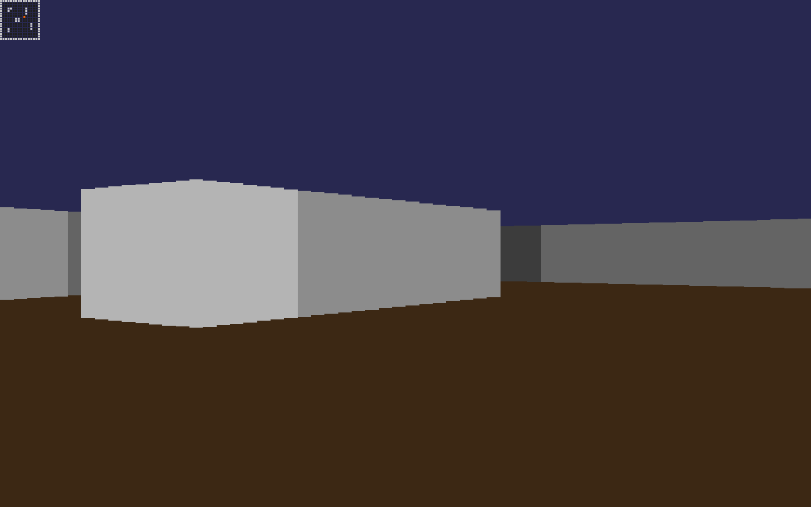
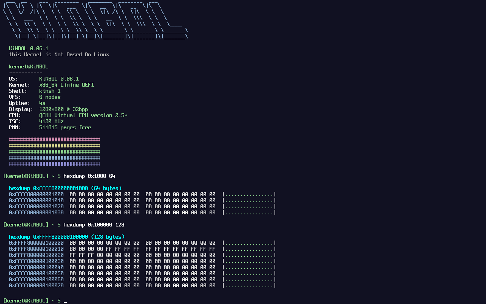
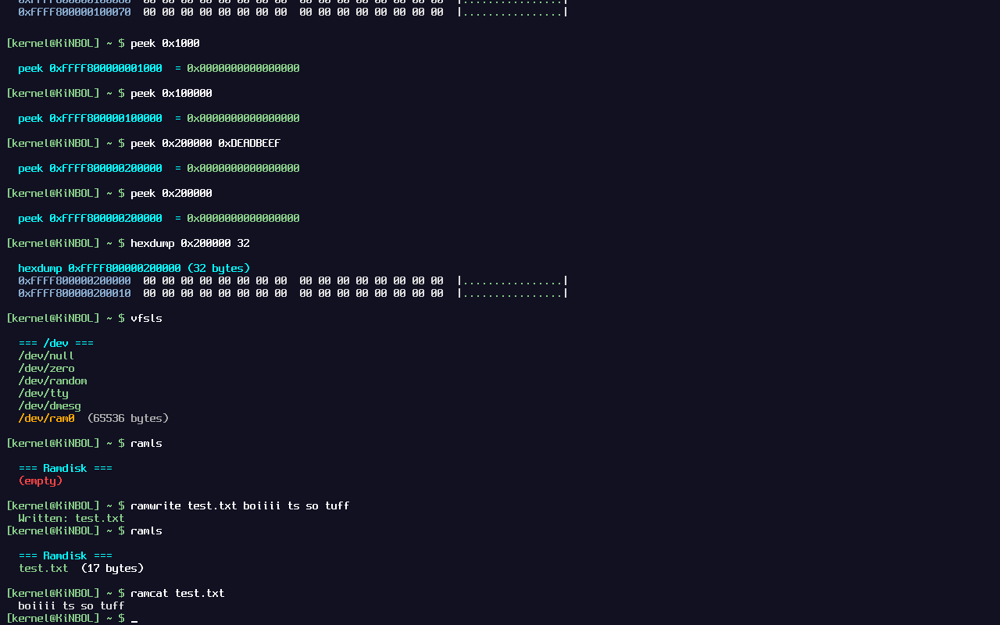

# KiNBOL
> **this Kernel is Not Based On Linux**

> *"I'm doing a (free) operating system (just a hobby, won't be big and professional like Linux)."*
>
> — Linus Torvalds, 1991

A hobby x86_64 operating system written completely from scratch.

KiNBOL (formerly **FreeARS**) is an educational operating system developed from scratch for the x86_64 architecture.

Initially created as a simple framebuffer kernel, it has evolved into a modern UEFI kernel featuring memory management, interrupt handling, storage abstractions and the foundations for multitasking.

## Current Status

| Version | 0.06.2 |
|---------|---------|
| Architecture | x86_64 |
| Boot | UEFI + Limine |
| Branch | `x86_64-uefi` |
| State | Active Development |

## Highlights

- UEFI Boot
- x86_64 Long Mode
- GDT + TSS
- IDT
- PIC Remapping
- APIC
- IOAPIC
- LAPIC Timer
- IRQ0 Timer Interrupts
- Physical Memory Manager
- Heap Allocator
- VFS
- Ramdisk
- RTC
- Shell
- Software Renderer
- Raycasting Demo

## Screenshots

### Raycasting (Removed, as 0f 0.06.2 - You can still implement it by yourself tho)

### Fastfetch

## What's New — 0.06.2

### Interrupt Subsystem

- GDT
- TSS
- IDT
- PIC Remapping
- APIC
- IOAPIC
- LAPIC Timer
- IRQ0 finally working 🎉

This is one of the biggest milestones of KiNBOL so far.

For months, **IRQ0 simply refused to work**. After countless debugging sessions, the entire interrupt subsystem is finally operational.

This unlocks:

- Scheduler
- Multitasking
- Time slicing
- Accurate sleep()
- System clock
- Better hardware support

## Existing Features

### Boot

- UEFI
- Limine

### CPU

- CPUID
- GDT
- TSS
- IDT
- Exceptions
- Interrupts
- APIC
- IOAPIC
- LAPIC Timer

### Memory

- PMM
- Heap
- Heap statistics
- Memory debugger

### Storage

- VFS
- Ramdisk

### Drivers

- PS/2 Keyboard
- RTC
- Serial
- Framebuffer

### Shell

- Fastfetch
- Calculator
- dmesg
- Memory tools
- 20+ commands

## Roadmap

- [ ] Paging
- [ ] Virtual Memory Manager
- [ ] Scheduler
- [ ] Multitasking
- [ ] Syscalls
- [ ] Ring 3
- [ ] ELF Loader
- [ ] FAT32
- [ ] AHCI

## Version History

| Version | Description |
|----------|-------------|
| 0.01 | First framebuffer kernel |
| 0.02 | 64-bit mode |
| 0.03 | Framebuffer improvements |
| 0.04 | UEFI + Limine |
| 0.05 | PMM + Heap |
| 0.06 | Shell + Drivers |
| 0.06.1 | VFS + Ramdisk + dmesg |
| **0.06.2** | **Modern interrupt subsystem (GDT, TSS, IDT, APIC, IOAPIC, LAPIC, IRQ0)** |

## Philosophy

KiNBOL exists purely as a learning project.

Every subsystem is written from scratch to better understand how modern operating systems actually work.
Being fr, Claude.ai helped me build the APIC, LAPIC and IOAPIC. Sorry guys, I surrendered to AI.

## Tested On

- ✅ QEMU
- ✅ VirtualBox
- ✅ Real Hardware

## License

Do whatever you want.

It's a hobby.