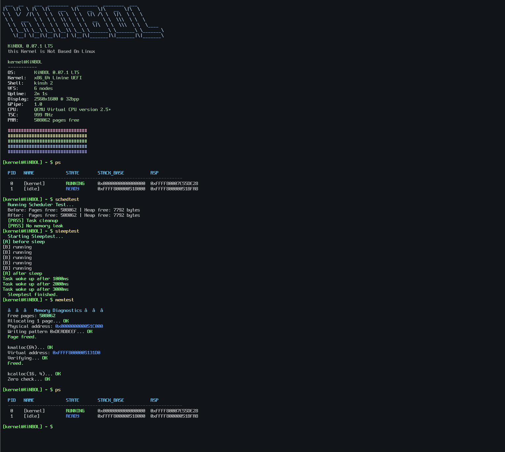
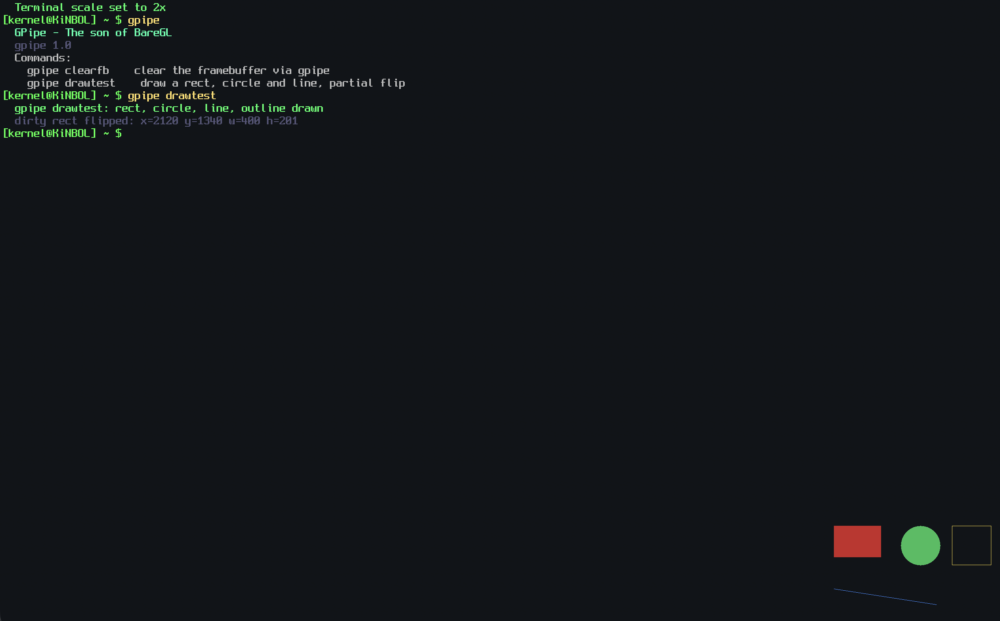

# KiNBOL

> **this Kernel is Not Based On Linux**

x86_64 · UEFI · Limine · Ring 0 + Ring 3

---

## 0.07.1 cmd test (outdated)


## 0.07.1 gpipe (outdated)


*be advised: this screenshot may not correspond to the newest commit. things move fast around here.*

---

## what is this

KiNBOL is a hobby OS I'm building from scratch to learn how operating systems actually work. It started as a simple framebuffer kernel and grew into something with memory management, interrupts, a scheduler, syscalls, and user mode.

Most things here are written from scratch, and a lot of documentation.

---

## current state

| subsystem | status |
|---|---|
| UEFI boot (Limine) | ✅ 64-bit long mode |
| GDT + TSS | ✅ user segments + RSP0 per-task |
| IDT + exceptions | ✅ page fault, GP, etc. + RFLAGS/CS dump |
| PIC → LAPIC/IOAPIC | ✅ PIC disabled, IOAPIC active |
| ACPI (poweroff) | ✅ S5 shutdown |
| PMM (freelist) | ✅ dynamic HHDM |
| VMM (4-level paging) | ✅ pagemap created |
| Heap (first-fit + coalesce) | ✅ 16-byte aligned |
| Spinlock / Big Kernel Lock | ✅ lock xchg + BKL, active since `sched_init()` |
| Scheduler | ✅ cooperative + intelligent preemption (user tasks preempted, kernel/shell protected) |
| Ring 3 + syscalls | ✅ `syscall/sysret` (Linux ABI), `SYS_WRITE`/`SYS_EXIT`/`SYS_READ`/`SYS_SLEEP`/`SYS_YIELD`, user pointer + RSP validation, `usertest` shell cmd |
| VFS + ramdisk | ✅ /dev nodes + in-memory fs |
| framebuffer (1080p) | ✅ text terminal + GPipe 1.0 unified — both draw into the same back buffer, only `gpipe_flip`/`gpipe_flip_full` touches real VRAM |
| shell | ✅ commands + history + tab completion (subcommands) |

> scheduling is cooperative with intelligent preemption: tasks give up the CPU voluntarily (`sleep_ms`, `task_exit`, explicit yield). the LAPIC timer fires at 100Hz and hooks into the scheduler, but **kernel tasks and the shell are protected from preemption** (tasks with names starting with `[` are never preempted). this means the terminal/keyboard remain responsive at all times, while user-mode tasks (`usertest`, `schedtest`, etc.) are preempted automatically. **this matters for ring 3**: a user-mode program is CPL-isolated from crashing the kernel, and now also can't hang it indefinitely — the scheduler will preempt spinning userspace tasks. the Big Kernel Lock provides the locking foundation for this, preventing context switches mid-operation on unprotected shared state.
>
> every syscall entry validates the user-supplied pointers it's handed (`syscall_check_user_ptr()`, backed by `vmm_check_user_range()` walking the 4-level page tables). we also validate the RSP the task trapped in with (`syscall_check_user_rsp()`). the RSP check exists because if a task forges a garbage RSP before invoking `syscall`, nothing stops the kernel from handing it straight back on the way out via `sysret`, which corrompts the task's own return into userspace. a task that fails either check gets killed via `task_exit()` instead of being allowed to run the syscall.
>
> ring 3 tasks now have full process isolation via per-task address spaces! `task_create_user()` clones a new pagemap (`vmm_create_pagemap()`) for every user task, and `CR3` context switches automatically inside the scheduler. This guarantees that one user program cannot read or write another user program's memory.

---

## building

```bash
make            # build the ISO
make TOOLCHAIN=llvm run        # build + run in QEMU (UEFI)
```

needs: `make`, `x86_64-elf-gcc`, `nasm`, `qemu-system-x86_64`, `xorriso`, `mtools`

> [DEPRECATED WONT WORK] macOS with HVF acceleration: `make run-hvf`

---

## shell commands

| category | commands |
|---|---|
| system | `ps`, `dmesg`, `dmesg --clear`, `uname`, `ticks`, `date`, `sleep`, `reboot`, `shutdown`, `fastfetch`, `help`, `clear`, `syscalls`, `libktest` |
| memory | `meminfo`, `memtest`, `vminfo`, `hexdump`, `peek`, `poke` |
| filesystem | `ramls`, `ramcat`, `ramwrite`, `ramdel`, `vfsls`, `vfsread`, `vfswrite` |
| graphics | `clearfb`, `scale`, `gpipe`, `gpipe clearfb`, `gpipe drawtest` |
| scheduler | `schedtest`, `sleeptest`, `top` |
| ring 3 | `usertest` — spawns a task, enters ring 3 via `iretq`, runs a hand-written user blob that calls `SYS_WRITE`/`SYS_SLEEP`/`SYS_EXIT` through the modern `syscall` instruction (Linux ABI) |
| debug | `crash de`, `crash ud`, `crash pf`, `crash gp` — deterministic faults for exercising the exception dump (no UB; `crash gp` triggers via `wrmsr`, run from ring 0) |
| utilities | `calc`, `ascii`, `anim`, `mstat` |

---

## GPipe replaces BareGL

BareGL is fully deprecated, moved to `src/graphics/api/deprecated-legacy/`. GPipe 1.0 is the active graphics API:

- explicit context (`gpipe_ctx_t`) instead of hidden global state
- back buffer allocated straight from the PMM (`pmm_alloc_pages_contiguous`), not the small-block heap
- dirty-rect flip — `gpipe_flip()` only pushes the region that changed, `gpipe_flip_full()` forces the whole frame
- full clipping on every primitive (rect/circle/line/bmp)

test it: `gpipe`, `gpipe clearfb`, `gpipe drawtest`

**terminal + GPipe are unified.** `gpipe_get_draw_target()` is the single choke point: `chr()`, `scroll()`, `terminal_clear()`, and `terminal_cursor_draw()` all draw into GPipe's back buffer (falling back to the raw fb only during early boot, before `gpipe_init()` has run), then flip. `gpipe_flip()`/`gpipe_flip_full()` are the only code that ever writes real VRAM. No more stale/ghost pixels when text and gpipe drawing land on the same frame.

**if you're hacking on graphics, use the terminal framebuffer directly. baregl will either get fixed or removed in a future version.**

---

## roadmap

- [x] paging & VMM
- [x] ACPI, APIC, IOAPIC
- [x] cooperative scheduler
- [x] task reaper + sleep
- [x] kernel locks (big-kernel-lock)
- [x] GPipe (BareGL successor): ctx-based, dirty-rect flip, pmm-backed buffer
- [x] syscalls (`syscall`/`sysret`, Linux ABI, `SYS_WRITE`/`SYS_EXIT`)
- [x] ring 3 (`sysret` into CPL=3, per-task kernel/user RSP)
- [x] preemptive scheduling (intelligent: user tasks preempted, kernel/shell protected)
- [x] syscall pointer validation (`syscall_check_user_ptr()` / `vmm_check_user_range()`)
- [x] syscall RSP validation (`syscall_check_user_rsp()`)
- [x] `SYS_READ` (path-based, reads through the VFS), `SYS_SLEEP`, `SYS_YIELD`
- [x] unify terminal + GPipe into one drawing path (`gpipe_get_draw_target()`, single flip choke point)
- [x] per-task address spaces (VMM)!
- [x] PS/2 Mouse driver
- [ ] ELF loader
- [ ] FAT32
- [ ] AHCI/SATA

---

## license

MIT. do whatever you want, just keep the copyright notice.